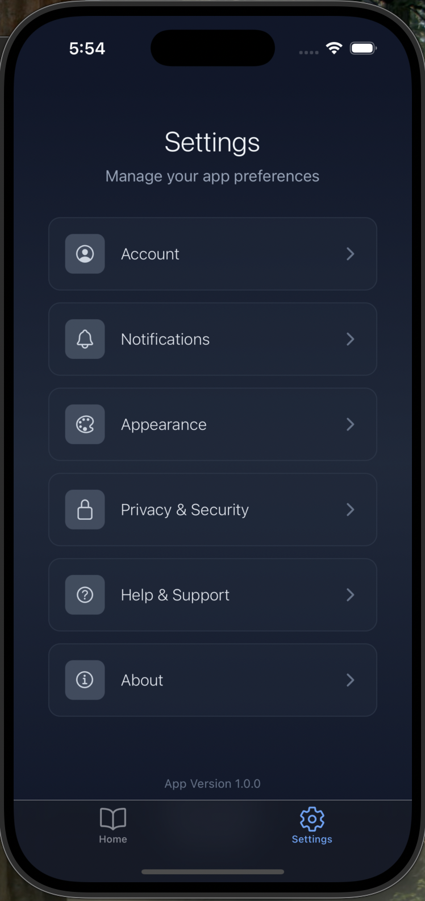

# RN Expo Ebook Template

## The professional-grade template trusted by authors to launch their books as premium web and mobile apps

Welcome to the RN Expo Ebook Template, a cutting-edge solution designed for authors who want to transform their literary works into immersive digital experiences. This template provides a robust foundation for publishing your book as a high-quality web and mobile application, reaching your readers wherever they are.

---

### ✨ Why Choose This Template?

- **Multi-Platform Reach**: Seamlessly deploy your book to iOS, Android, and the web from a single codebase.
- **Stunning User Experience**: Deliver a beautiful, intuitive, and engaging reading experience with a modern UI.
- **Chapter-Based Navigation**: Organize your content logically with easy-to-use table of contents and chapter navigation.
- **Customizable Themes**: Offer readers personalized reading environments with built-in theme options.
- **Developer-Friendly**: Built with Expo and React Native, ensuring a smooth development workflow and easy customization.

---

### 🚀 Features at a Glance

- **Dynamic Table of Contents**: Automatically generated from your chapter data.
- **Responsive Design**: Adapts gracefully to various screen sizes and orientations.
- **Intuitive Navigation**: Smooth transitions and clear pathways for readers.
- **Theming Support**: Easily switch between light and dark modes, or add your own custom themes.
- **Optimized for Performance**: Fast and fluid reading experience.

---

### 📸 Screenshots

Here are some glimpses of what your ebook app can look like. (Placeholder images, will be updated with actual app screenshots soon!)

#### Home Screen


#### Settings Screen



#### Appearance Settings


#### Table of Contents


#### Reading View


---

### 🛠 For Developers

This project is an [Expo](https://expo.dev) project created with [`create-expo-app`](https://www.npmjs.com/package/create-expo-app).

1. **Install dependencies**

   ```bash
   npm install
   ```

2. **Start the app**

   ```bash
   npx expo start
   ```

In the output, you'll find options to open the app in a

- [development build](https://docs.expo.dev/develop/development-builds/introduction/)
- [Android emulator](https://docs.expo.dev/workflow/android-studio-emulator/)
- [iOS simulator](https://docs.expo.dev/workflow/ios-simulator/)
- [Expo Go](https://expo.dev/go), a limited sandbox for trying out app development with Expo

You can start developing by editing the files inside the **app** directory. This project uses [file-based routing](https://docs.expo.dev/router/introduction).

---

### 📚 Learn More

To learn more about developing your ebook with our template, look at the following resources:

- [App documentation](/): Learn from our documentation
- [Learn by handmade tutorial](/): Follow a step-by-step tutorial where you'll create a stunning ebook that runs on Android, iOS, and the web.

---

### 🤝 Join the Community

Join our community of developers creating universal apps.

- [Dev Discussion on GitHub](https://github.com/): View our open source platform and contribute.
- [Discord community](https://discord.com): Chat with the core team and other users and ask questions.
